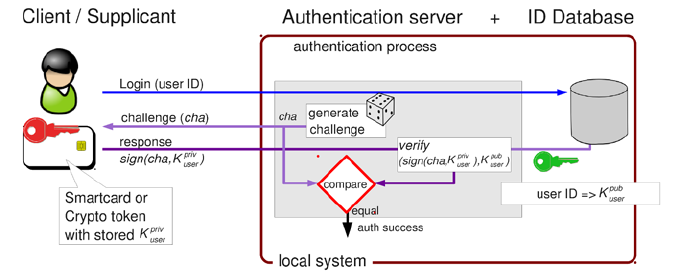

### 2. ✅ Quy Trình "Chuẩn Chỉ" (Đã Điều Chỉnh)

#### Giai Đoạn A: Tạo Thẻ (Personalization) - Khi thẻ trắng
1.  **Swing:** Nhập Info (Tên, Tuổi...) + Mã PIN.
2.  **Swing -> Thẻ:** Gửi lệnh `CREATE_CARD` kèm PIN.
3.  **Thẻ (Applet):**
    * Khởi tạo đối tượng `OwnerPIN` với mã PIN vừa nhận.
    * Tạo cặp khóa RSA (GenKeyPair). Lưu Private Key vào thẻ (cấm tuyệt đối mang ra ngoài).
    * Lưu Info (đã mã hóa AES - nếu kịp làm, không thì lưu plaintext trước).
    * **Trả về:** Public Key + Card ID.
4.  **Swing -> Backend:** Gửi `{CardID, PublicKey, UserInfo}`.
5.  **Backend:** Lưu vào Database.

#### Giai Đoạn B: Sử Dụng Thẻ (Authentication)

**Bước 1: Mở khóa thẻ (Verify PIN)**
* **Người dùng:** Nhập PIN trên Swing.
* **Swing -> Thẻ:** Gửi APDU `VERIFY_PIN` (chứa PIN).
* **Thẻ:** Dùng hàm `pin.check()`.
    * Nếu Sai: Giảm số lần thử. Trả về lỗi. (Nếu sai quá 3 lần -> Khóa thẻ).
    * Nếu Đúng: Trả về `90 00`. **Mở khóa tường lửa** cho phép dùng Private Key.

**Bước 2: Xác thực thẻ & Lấy thông tin (RSA Challenge-Response)**
* *(Chỉ làm bước này nếu Bước 1 thành công)*
* **Swing -> Backend:** "Ta muốn lấy thông tin của thẻ có ID này".
* **Backend:**
    1.  Tìm Public Key của thẻ đó trong DB.
    2.  Tạo một chuỗi ngẫu nhiên (Challenge - $cha$).
    3.  Gửi $cha$ về Swing.
* **Swing -> Thẻ:** Gửi APDU `SIGN_CHALLENGE` (kèm $cha$).
* **Thẻ:**
    * Kiểm tra: Đã nhập PIN chưa? (Nếu chưa -> Chặn).
    * Dùng **Private Key** ký lên $cha$ -> Tạo ra $signature$.
    * Trả $signature$ về Swing.
* **Swing -> Backend:** Gửi $signature$.
* **Backend:**
    * Dùng **Public Key** (đang có trong DB) để `verify` cái $signature$ kia.
    * Nếu khớp: => **Chứng tỏ thẻ này là thẻ thật (có Private Key) và người dùng đã nhập đúng PIN.**
    * Trả về: Thông tin người dùng (UserInfo) để hiển thị lên Swing.
